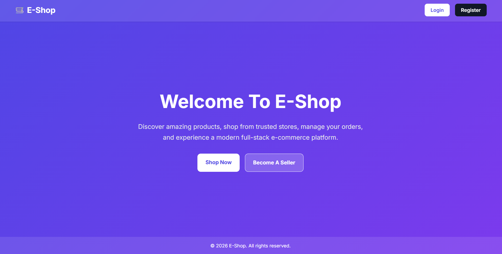
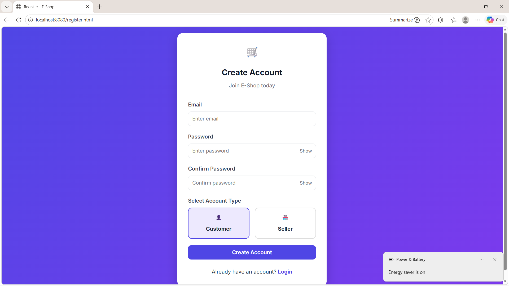
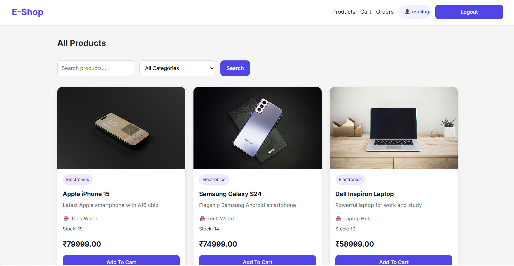
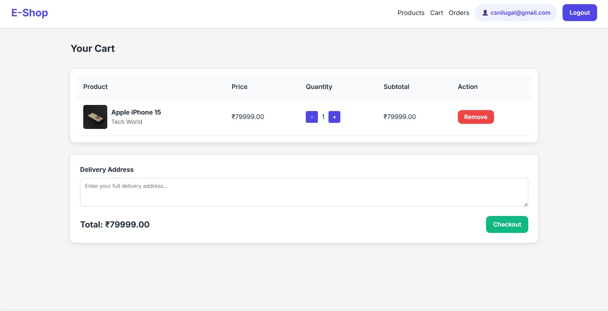
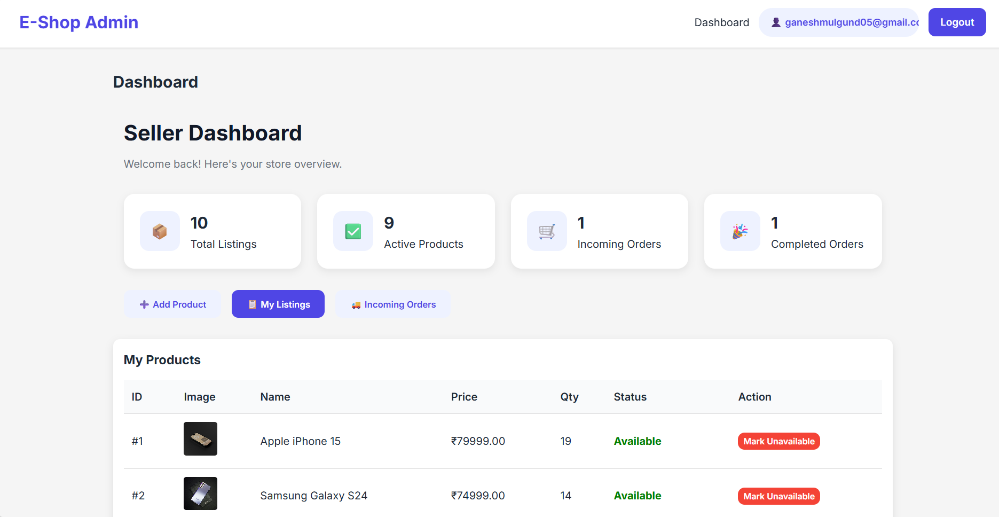
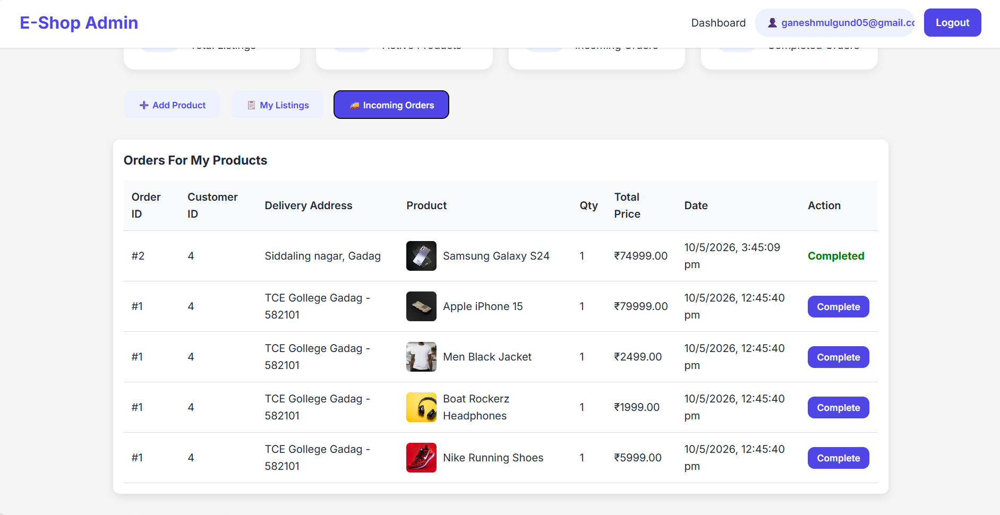

# 🛒 E-Shop

> A Full-Stack E-Commerce Application built with Spring Boot, Hibernate, JPA, and MySQL.


---

## ✨ Features

### 👤 User Management
- User Registration
- Secure Login Authentication
- Password Encryption
- Role-Based Access

### 📦 Product Management
- Add Products
- Update Products
- Delete Products
- View Product Details
- Search Products

### 🛒 Shopping Cart
- Add Items to Cart
- Update Quantity
- Remove Products
- View Cart Summary

### 📋 Order Management
- Place Orders
- View Order History
- Order Tracking

### 🛡️ Security & Reliability
- Input Validation
- Global Exception Handling
- RESTful API Design
- Layered Architecture

---

## 🏗️ Project Architecture

```text
Client
   │
   ▼
Controller Layer
   │
   ▼
Service Layer
   │
   ▼
Repository Layer
   │
   ▼
MySQL Database
```

---

## 🛠️ Tech Stack

| Technology | Purpose |
|------------|---------|
| Java 17 | Programming Language |
| Spring Boot | Backend Framework |
| Spring Data JPA | Database Operations |
| Hibernate | ORM Framework |
| MySQL | Database |
| Maven | Dependency Management |
| Lombok | Boilerplate Reduction |
| REST API | Client Communication |

---

## 📂 Project Structure

```text
src
├── controller
├── service
├── repository
├── model
├── dto
├── exception
├── config
└── resources
```

---

## 🚀 Getting Started

### Clone Repository

```bash
git clone https://github.com/your-username/e-shop.git
```

### Navigate to Project

```bash
cd e-shop
```

### Configure Database

Update:

```properties
spring.datasource.url=
spring.datasource.username=
spring.datasource.password=
```

### Run Application

```bash
mvn spring-boot:run
```

Application starts at:

```text
http://localhost:8080
```

---

## 🔥 API Endpoints

### Authentication

```http
POST /auth/register
POST /auth/login
```

### Products

```http
GET    /api/products
GET    /api/products/{id}
POST   /api/products
PUT    /api/products/{id}
DELETE /api/products/{id}
```

### Cart

```http
GET    /cart
POST   /cart/add
DELETE /cart/remove/{id}
```

### Orders

```http
POST /orders
GET  /orders/{id}
GET  /orders/history
```

---

## 🎯 Key Highlights

✅ RESTful API Development

✅ Spring Boot Best Practices

✅ Global Exception Handling

✅ Input Validation

✅ Layered Architecture

✅ Database Integration using JPA & Hibernate

✅ Real-World E-Commerce Workflow

---

## 📸 Screenshots

> Add your application screenshots here

### Home Page



### Account Registration



### Product Page



### Cart



### Seller Dashboard



### Seller Orders Received



---

## 🤝 Contributing

Contributions are welcome!

```bash
Fork ➜ Create Branch ➜ Commit ➜ Push ➜ Pull Request
```

---

## 👨‍💻 Author

**Channaveeresh Shanmukhappa Nilugal**

- GitHub: https://github.com/csnilugal
- LinkedIn: https://linkedin.com/in/channaveeresh-nilugal-b787a727a

---

⭐ If you found this project useful, don't forget to star the repository!
